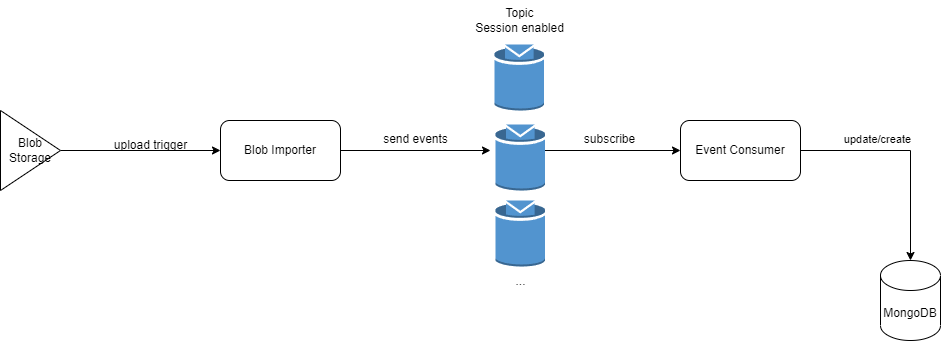

# Azure Course - Project
### Events Importer
#### Ivan Alexandru

Components:
- CosmosDB using MongoDB API
- Service Bus with Topics and subscriptions
- Azure Function App container
- Storage Account

Functions:
- Blob Triggered Import function
  - Triggered by uploading files in the container
- Event Triggered Consumer function
  - Triggered by events posted on subscription

